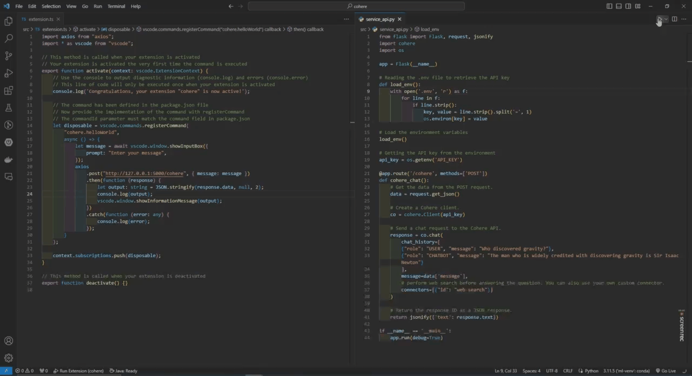

# README

This is the README for my extension Cohere Chat.

## Features

1. Sign up at Cohere to get your free Trial Key. 
2. Create a .env file and write your API inside the file just like this:  API_KEY=2q723221adad1223g6Ytcedfgh2341 
3. Run the service_api.py script. It will keep running as an API. 
4. Press F5 to activate the extension environment, it will open a new VSC window. 
5. Press CTRL+SHIFT+P and type Hello World, select it and then type what you want for the LLM. It takes a while for the output to come in, around 15 seconds. 

## Requirements

### API key

Sign up at Cohere to get your free Trial Key.
Create a .env file and write your API inside the file just like this: API_KEY=2q723221adad1223g6Ytcedfgh2341

### Python Dependencies

pip install flask  
pip install cohere  

### NPM Dependencies

npm install  
npm install axios  
npm install --save @vscode/webview-ui-toolkit

**Enjoy!**
